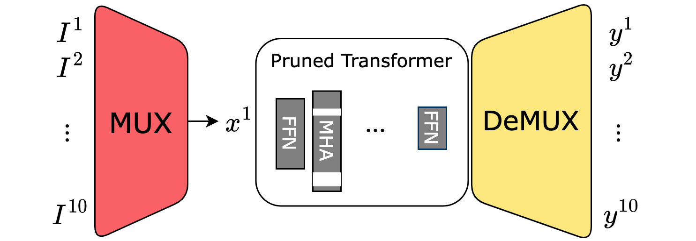

## PruMUX ##

PyTorch implementation for the paper:

**[PruMUX: Augmenting Data Multiplexing with Model Compression for High Throughput Transformers]()**  
Yushan Su, Vishvak Murahari, Karthik Narasimhan, Kai Li



<!-- If you find this work useful in your research, please cite:

```

``` -->


### Setup and Dependencies

Our code is implemented in PyTorch. To setup, do the following:

1. Install [Python 3.10.8](https://www.python.org/downloads/release/python-3108/)
2. Get the source:
```
git clone https://github.com/yushansu/PruMUX.git prumux
```
3. Install requirements into the `prumux` virtual environment, using [Anaconda](https://anaconda.org/anaconda/python):
```
conda env create -f prumux.yml
```

### Usage

#### Overview
For PruMUX training, refer to `run_PruMUX.sh` and `run_PruMUX_FT.sh`. For PruMUX inference, refer to `evaluation.py`.
#### PruMUX checkpoints
We release Prumux [checkpoints](https://drive.google.com/file/d/1CPQLo5r4wlgAgvDnVRdKkcU-_kk58sjq/view?usp=sharing) for all parameter combinations in the paper's Figure 3. 

#### Settings

We use the following hyperparamters for training PruMUX:

|               | PruMUX | 
|:--------------|:-----------:|
| Pruning batch size  | 32*N   | 
| Pruning learning rate  | 64 | 
| Layer distill. alpha | 0.9, 0.7, 0.5|
| Cross entropy distill. alpha | 0.1, 0.3, 0.5|
| Training epoch | 40 |
| Finetuning epoch | 40 | 
| Prepruning finetuning epochs | 0 | 
| Lagrangian warmup epochs | 2 | 
| Pruning learning rate | 5e-5|
| Fine-tuning learning rate | 1e-5, 2e-5, 3e-5, 5e-5|


Below we list exemplar commands for PruMUX training:

#### Training
An example runs pruning is as follows:
```
TASK=MNLI
SPARSITY=0.60
N=2
DISTILL_LAYER_LOSS_ALPHA=0.9
DISTILL_CE_LOSS_ALPHA=0.1
LAYER_DISTILL_VERSION=4

bash scripts/run_PruMUX.sh $TASK $SPARSITY $N $DISTILL_LAYER_LOSS_ALPHA $DISTILL_CE_LOSS_ALPHA $LAYER_DISTILL_VERSION
```

#### Finetuning
An example for finetuning after pruning is as follows:
```
TASK=MNLI
SPARSITY=0.60
N=2
DISTILL_LAYER_LOSS_ALPHA=0.9
DISTILL_CE_LOSS_ALPHA=0.1
LAYER_DISTILL_VERSION=4
LEARNING_RATE=3e-5

bash scripts/run_PruMUX_FT.sh $TASK $SPARSITY $N $DISTILL_LAYER_LOSS_ALPHA $DISTILL_CE_LOSS_ALPHA $LAYER_DISTILL_VERSION $LEARNING_RATE
```


#### Evaluation
An example for evaluation is as follows:
```
TASK=MNLI
SPARSITY=0.60
N=2

python evaluation.py $TASK $SPARSITY $N 
```


<!-- ### Reference
```
 -->
<!-- ``` -->
<!-- ### License
Check `LICENSE.md` -->
